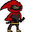
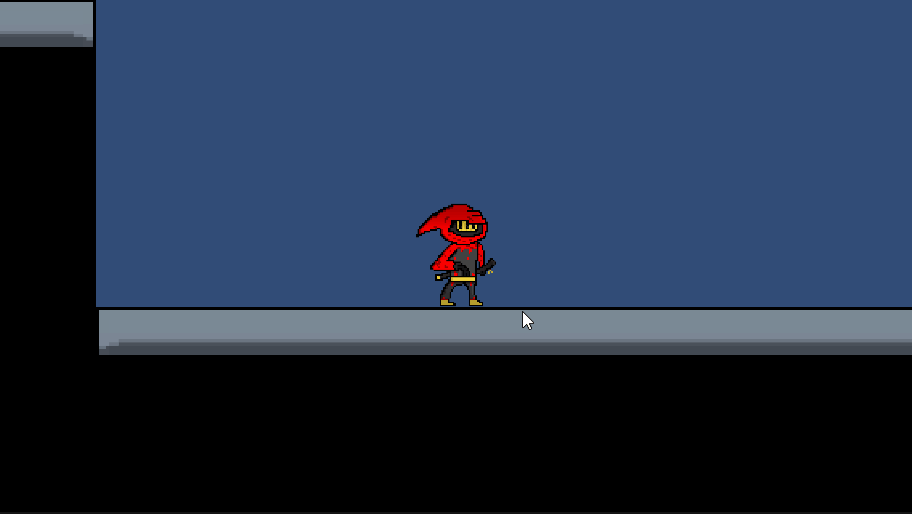
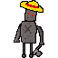

# Spiders


## Description :page_with_curl:

A 2D action platformer based off of the one hit kill mechanic in games like Hotline Miami and Katana Zero. The platforming is very basic and simple allowing for everybody to play and the combat is based around kiting the enemy and staying out of the way while you pick them off one by one. You run around a city as a hooded knight with a sword who has a vendetta against robotic spiders. The whole city was overrun with spiders and this man feels the need to kill them all. The goal is to kill all the spiders in this city as that is really the only thing you can do. The spiders aren't pushovers though as they can take you down in the same amount of hits it takes for you to kill them, one. Everytime you do you get sent back to the beginning with the progress you made being saved meaning that enemies don't respawn unless you close and reopen the game. 



## Features that work :green_circle:

 - The player can move and jump
 - The player has a working idle, walk animation and attack animation
 - Moving enemies that move back and forth, and are capable of killing you
 - A respawn feature so when killed you start again
 - An attack so that you can kill the spiders before they kill you
 - A walljump that lets you jump off of walls
 - The main menu at the beggining of the game with a start button, options button and a quit button
 - Camera follow
 - The level and design

## Features that don't work :red_circle:

 - The enemy that was planned to have AI 
 

## Gameplay


 

## Getting Started

### Dependencies

* Describe any prerequisites, libraries, OS version, etc., needed before installing program.
* ex. Windows 10

### Installing

* How/where to download your program
* Any modifications needed to be made to files/folders

### Executing program

* How to run the program
* Step-by-step bullets
```
code blocks for commands
```

### Controls :video_game: 

| Action        | Key           |
| ------------- | ------------- |
| Walk Right    | D             |
| Walk Left     | A             |
| Jump          | Space Bar     |
| Attack        | Left Click    |
| Interacting with the menu | Left Click |

### Objective

The main objective is to eradicate the spider populaton in the city and make sure the spider problem is no longer a problem. You do this by running through the city and attacking every enemy being really slow and careful, using the walljump and slide to help distance yourself and make sure that you yourself doesn't get attacked. Making your way through you eventually while walking left get greeted with nothingness which is when you then have to jump down and move on to the next part of the city. After that you climb through the tower for another leap of faith, and once you gotten to the top platform you've beaten the game. 

## Help

Any advise for common problems or issues.
```
command to run if program contains helper info
```

## Tutorials 
Here are the links to the tutorials I followed

- [Basic Walking and movement](https://youtu.be/K1xZ-rycYY8?si=0JWbixwB70NleL1Q)
- [Walljump and wallslide](https://youtu.be/O6VX6Ro7EtA?si=vunvXgcnf7KkFGuY)
- [Implementing animation](https://youtu.be/Sg_w8hIbp4Y?si=qfrNK7FZeO_Itm38)
- [Attack Tutorial](https://youtu.be/1QfxdUpVh5I?si=OPJz60mBvpF64x8R)
- [Main menu tutorial](https://youtu.be/DX7HyN7oJjE?si=GuJCelmL13gNQS_n)
- [Respawn](https://youtu.be/odStG_LfPMQ?si=75iPXhPENG36crD3)
- [Tile Palette](https://youtu.be/vN4H7N_k3eg?si=59vRQyFJDF44vL4I)
- [Camera Follow](https://youtu.be/QfLhSzeZaoA?si=CPhoywyxf_Nviifm)
- [Enemey Ai, Setting Up](https://youtu.be/qgX941I-YqE?si=pqz6LqL4p7JPeGK0)
- [Enemy Ai, Coding attack](https://youtu.be/waj6i9cQ6rM?si=QH59uCGbhTa9D9E3)
- [Basic Enemy Patrolling](https://youtu.be/RuvfOl8HhhM?si=CMdv_IgQWeFpWhmu)

## Challenges Faced During Development

A lot of challenges arised during development, adding features was a challenge a lot of the time seeing as this is the first ever game i have developed, adding scripts and making all the code I had written work together was a challenge it felt like a puzzle at times. The first feature I had trouble with was the attack adding enemies wasn't too hard and took me only a couple of hours, but killing them was a challenge as setting up the attack to work and kill took a while. The main struggle though which never ended up working was the enemy who was planned to actually have attacks, even though the tutorial was clear and concise, I still messed it up. Getting animations to work was a huge challenge as well as getting the movement didn't work until I finally found the tutorial the cleared everything up for me getting the movement animation working and later the attack animation. All these challenges wer overcome through me trial and erroring a lot of stuff to understand what is going on and how the programming and code works. I learnt a lot from this project and I'm sure that the next game I make will be a lot better with all the knowledge I now have. 


## Game Assets

All the game assets were designed, drawn and animated by me. The were all drawn and animated in Aseprite and were designed on paper with a pencil. 



## Authors

Contributors names and contact info

ex. Mr Jones
ex. [@benpaddlejones](https://github.com/benpaddlejones)

## Version History

* 0.2
    * Various bug fixes and optimizations
    * See [commit change]() or See [release history]() or see [branch]()
* 0.1
    * Initial Release

## License

This project is licensed under the [NAME HERE] License - see the LICENSE.md file for details

## Acknowledgments

Inspiration, code snippets, etc.
* [Github md syntax](https://docs.github.com/en/get-started/writing-on-github/getting-started-with-writing-and-formatting-on-github/basic-writing-and-formatting-syntax)
* [TempeHS Unity template](https://github.com/TempeHS/TempeHS_Unity_DevContainer)
